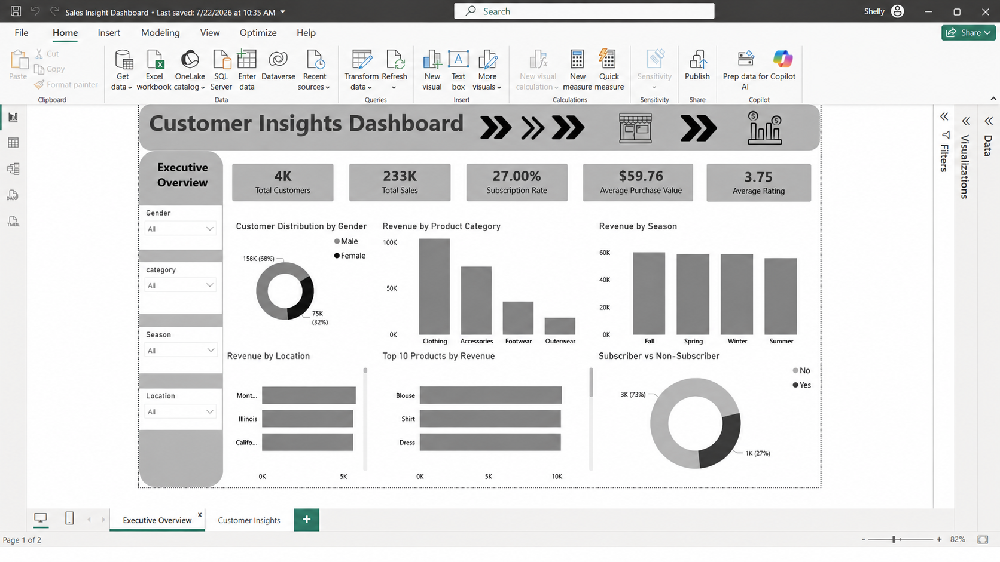
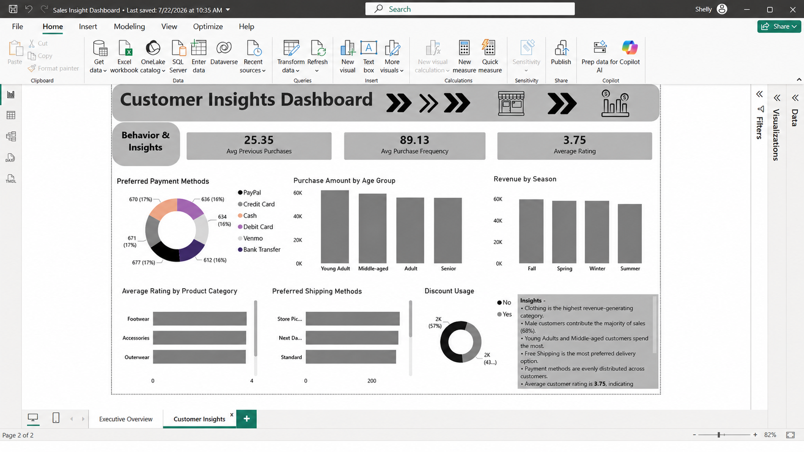

# 📊 Customer Insights Dashboard

## 📌 Project Overview

The **Customer Insights Dashboard** is an interactive Business Intelligence solution developed using **SQL, Pandas, and Power BI** to transform raw sales and customer data into meaningful business insights. The dashboard enables stakeholders to monitor sales performance, understand customer behavior, and make data-driven decisions through interactive reports and KPIs.

---

## 🎯 Business Problem

Businesses generate large volumes of sales and customer data every day. However, without a centralized reporting system, decision-makers often struggle to:

- Monitor overall sales performance
- Understand customer purchasing behavior
- Track revenue trends
- Identify high-value customers
- Discover growth opportunities
- Make informed business decisions

This dashboard addresses these challenges by consolidating sales and customer metrics into a single interactive Power BI report.

---

## 🎯 Business Objectives

The dashboard helps stakeholders to:

- Monitor overall sales performance through key KPIs
- Analyze customer behavior and purchasing trends
- Identify top-performing products and customer segments
- Support data-driven decisions for improving sales and customer engagement

---

# 📊 Dashboard Pages

## 1️⃣ Executive Overview

Provides a high-level summary of business performance through interactive KPIs and visualizations.

### Key Metrics

- Total Revenue
- Total Sales
- Total Customers
- Average Order Value
- Sales Performance

### Business Value

Provides management with an executive view of overall business performance and key performance indicators.

---

## 2️⃣ Customer Insights

Analyzes customer purchasing behavior and revenue contribution through interactive visualizations.

### Key Analysis

- Customer Segmentation
- Purchasing Trends
- Revenue Performance
- Top Customers
- Customer Behavior

### Business Value

Helps stakeholders understand customer preferences, identify valuable customer segments, and improve customer engagement strategies.

---

# 🛠️ Tools & Technologies

- **SQL**
- **Pandas**
- **Power BI**
- **DAX**
- **Power Query**

---

# 📈 Key Features

- Interactive Power BI Dashboard
- SQL-based Data Extraction
- Data Cleaning & Transformation
- Dynamic KPIs
- Customer Segmentation
- Revenue Analysis
- Drill-through Reports
- Interactive Filters & Slicers
- Business Performance Monitoring

---

# 📊 Business Outcome

The dashboard enabled stakeholders to:

- Monitor sales and customer metrics from a centralized dashboard
- Identify business trends through interactive visualizations
- Improve decision-making using dynamic KPIs and reports
- Discover opportunities to increase revenue and strengthen customer relationships

---

# 📂 Repository Structure

```
Customer-Insights-Dashboard
│
├── Customer Insights Dashboard.pbix
├── SQL Queries.sql
├── README.md
├── Dashboard Screenshots/
└── Assets/
```

---

## 📷 Dashboard Preview

### Executive Overview



### Customer Insights




## ⭐ Key Skills Demonstrated

- SQL
- Python
- Power BI
- DAX
- Power Query
- Data Cleaning
- Data Modeling
- KPI Reporting
- Customer Analytics
- Sales Analytics
- Business Intelligence
- Data Visualization
